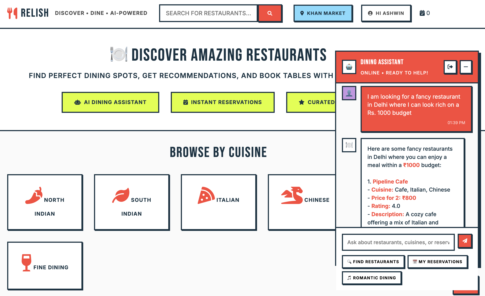
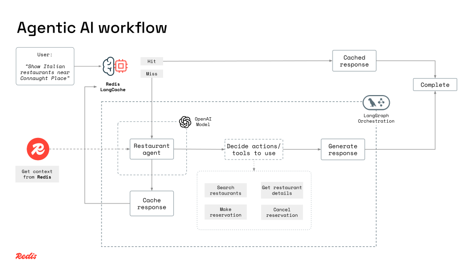

# 🍽️ Restaurant Discovery AI Agent

**Redis-powered restaurant discovery with intelligent dining assistance.**

An AI-powered restaurant discovery platform that combines Redis's speed with LangGraph's intelligent workflow orchestration. Get personalized restaurant recommendations, smart dining suggestions, and lightning-fast responses through semantic caching.

## App screenshots



---

## Tech Stack

- **[Node.js (v24+)](https://nodejs.org/)** + **Express** - Backend runtime and API framework
- **[Redis](https://redis.io)** - Restaurant store, agentic AI memory, conversational history, and semantic caching
- **[Redis LangCache API](https://redis.io/langcache/)** - Semantic caching for LLM responses
- **LangGraph** - AI workflow orchestration
- **[OpenAI API](https://platform.openai.com/account/api-keys)** - GPT-4 for intelligent responses and embeddings for vector search
- **HTML + CSS + Vanilla JS** - Frontend UI

---

## Product Features

- **Smart Restaurant Discovery**: AI-powered assistant helps you find restaurants, discover cuisines, and manage your reservations. Both text and vector-based search across restaurants
- **Dining Intelligence**: Get restaurant recommendations with detailed information for any cuisine or occasion using RAG (Retrieval Augmented Generation)
- **Demo Reservation System**: Reservation management - add, view, and manage restaurant reservations *(Simplified demo implementation, not a production-ready reservation system)*

### Technical features

- **Redis as memory layer**: For fast data retrieval
- **Vector Search**: Find restaurants using AI-powered similarity search
- **Semantic Cache**: Similar queries return instantly using Redis LangCache
- **LangGraph Workflows**: AI agent routing, tool selection
- **Multi-tool Agent**: Restaurant tools, search tools, reservation tools, and knowledge tools

---

## Getting started

### 1. Configure environment variables

```bash
cp .env.example .env
# Edit .env with your Redis URL, OpenAI key, and LangCache credentials
```

### 2. Installation

#### Option 1: Docker (Recommended)

**Quick start:**
```bash
# Build and start
docker compose build
docker compose up -d

# Load data (first time only)
docker compose exec relish-app npm run load-restaurants
docker compose exec relish-app npm run seed-dummy-users

# View logs
docker compose logs -f relish-app
```

**Subsequent runs:**
```bash
docker compose up
```

**To stop the service and remove containers:**
```bash
# Stop and remove containers
docker compose down
```

#### Option 2: Manual setup

1. Install dependencies:
   ```bash
   npm install
   ```

2. **Load restaurant data**

   ```bash
   npm run load-restaurants
   ```

3. **Load sample users**

   ```bash
   npm run seed-dummy-users
   ```

4. **Start the server**

   ```bash
   npm start
   ```

### 3. Access the app

Visit `http://localhost:3000/?name=ashwin` or any of the seeded users in your browser. Default port number can be customized via environment variables defined in the `.env` configuration file.

---

## Architecture

### Technical architecture





### Project architecture

```
│
├── package.json
├── index.js
├── config.js
├── modules/
│   ├── restaurants/          # Restaurant Component
│   │   ├── api/                 # REST API endpoints
│   │   ├── domain/              # Business logic and services
│   │   └── data/                # Data access layer
│   ├── reservations/         # Reservation Business Component
│   │   ├── api/
│   │   ├── domain/
│   │   └── data/
│   ├── chat/                 # Chat/Cache Component
│   │   ├── api/
│   │   ├── domain/
│   │   └── data/
│   ├── users/                # User Business Component
│   │   ├── domain/
│   │   └── data/
│   ├── ai/                   # Agentic AI Layer
│   
├── client/                   # Frontend assets
├── views/                    # HTML and Handlebars templates
├── scripts/                  # Data loading scripts
└── README.md                 # This file
```
---

## API Endpoints

- `POST /api/chat` - Main chat interface for AI restaurant assistant
- `GET /api/restaurants/search` - Search restaurants with text/vector similarity
- `POST /api/reservations/add` - Add restaurant reservations *(demo implementation)*
- `GET /api/reservations` - View reservation history *(demo implementation)*
- `DELETE /api/reservations` - Cancel reservations *(demo implementation)*

---

## Contributing

1. Fork the repository
2. Create your feature branch (`git checkout -b feature/amazing-feature`)
3. Commit your changes following [Conventional Commits](https://www.conventionalcommits.org/) (`git commit -m 'feat: add amazing feature'`)
4. Push to the branch (`git push origin feature/amazing-feature`)
5. Open a Pull Request

---

## Maintainers

- **Ashwin Hariharan** - [@booleanhunter](https://github.com/booleanhunter)

---

## License

This project is licensed under the MIT License - see the [LICENSE](/LICENSE) file for details.

---

## 🐞 Reporting Issues

If you find a bug or have a feature request, please open an issue in the repository.

---

## Motivations

This project is a **learning-focused demonstration** designed to help developers understand:

- **AI/ML Concepts**: Semantic search, vector embeddings, semantic caching, and agentic AI workflows
- **Full-Stack AI Architecture**: How to organize AI applications using clean architecture principles and modular design patterns
- **Integration Patterns**: Wiring together Redis, LangGraph, OpenAI, and LangCache in a real-world application

**What this project focuses on:**
- ✅ Semantic search and vector similarity
- ✅ LLM-powered agentic workflows with tool calling
- ✅ Semantic caching for performance optimization
- ✅ Clean, modular architecture for full-stack AI applications

**What this project does NOT focus on:**
- ❌ Complete business logic (e.g., real reservation systems, payment processing)
- ❌ Production-ready authentication/authorization

The features in this app such as reservation and user management are **intentionally simplified** to focus on demonstrating AI workflows and architecture patterns.

> 📖 **Read More**: Learn about the architectural principles in this [blog post](https://www.ashwinhariharan.com/organizing-ai-applications-lessons-from-traditional-software-architecture/).

---